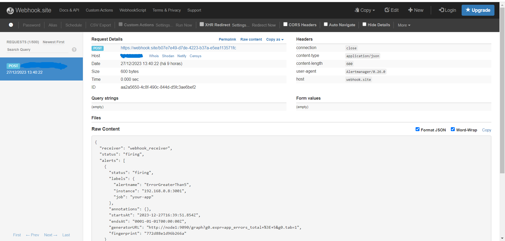

# Atividade Prática Observabilidade - Repositório

## Descrição
Este repositório contém a implementação do Desafio de Observabilidade (O2B), que inclui configurações do Prometheus, Grafana e outros componentes para monitoramento e observabilidade.

## Estrutura do Projeto
- `docker-compose.yml`: Arquivo de composição do Docker que define os serviços necessários para a infraestrutura de observabilidade.
- `rules.yml`: Arquivo contendo regras de alerta para o Prometheus.
- `alertmanager.yml`: Configuração do Alertmanager para lidar com alertas gerados pelo Prometheus.

## Ambiente Funcionando
Aqui estão alguns prints do ambiente em funcionamento:

### Dashboard Grafana


### Regras de Alerta Prometheus


## Webhook Disparado
O ambiente inclui um webhook que é acionado em resposta a eventos específicos. Aqui está uma captura de tela do webhook disparado:



## Como Usar
1. Clone o repositório:
   ```bash
   git clone https://github.com/AndresaTrentini/desafio-observabilidade-O2B.git

    cd desafio-observabilidade-O2B

2. Execute o Docker Compose: 
    ```bash
   docker-compose up -d
    
4. Acesse o Grafana e Prometheus nos seguintes endereços:
 - Grafana:  http://localhost:3000.
 - Prometheus: http://localhost:9090  
   
   

   
